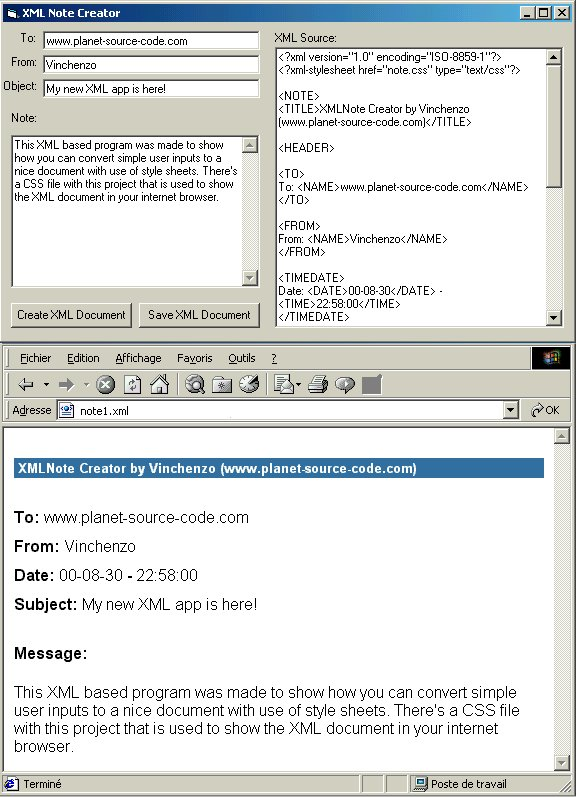

## XML Note Creator

### Description

Many people are trying to understand how XML work. This app show one of the applications you can give to XML. This is a simple note creator that will convert user-inputs into an XML document and with the style sheet included you will be able to save this document and display it in a browser (only tested on IE 5.x but should work on Netscape 4.6+). All the code is fully documented. Don't forget to unzip the .css file (the style sheet) in the same directory. Please rate it by your appreciation so I can continue create innovative applications.

Note: You can easily modify the style sheet.
 
### More Info
 
Not tested under Netscape.

             |
---                |---
**Submitted On**   |2000-08-30 23:05:48
**By**             |[Vincent Bouret](https://github.com/Planet-Source-Code/PSCIndex/blob/master/ByAuthor/vincent-bouret.md)
**Level**          |Intermediate
**User Rating**    |4.9 (88 globes from 18 users)
**Compatibility**  |VB 5\.0, VB 6\.0
**Category**       |[Internet/ HTML](https://github.com/Planet-Source-Code/PSCIndex/blob/master/ByCategory/internet-html__1-34.md)
**World**          |[Visual Basic](https://github.com/Planet-Source-Code/PSCIndex/blob/master/ByWorld/visual-basic.md)
**Archive File**   |[CODE\_UPLOAD94548302000\.zip](https://github.com/Planet-Source-Code/vincent-bouret-xml-note-creator__1-11125/archive/master.zip)

